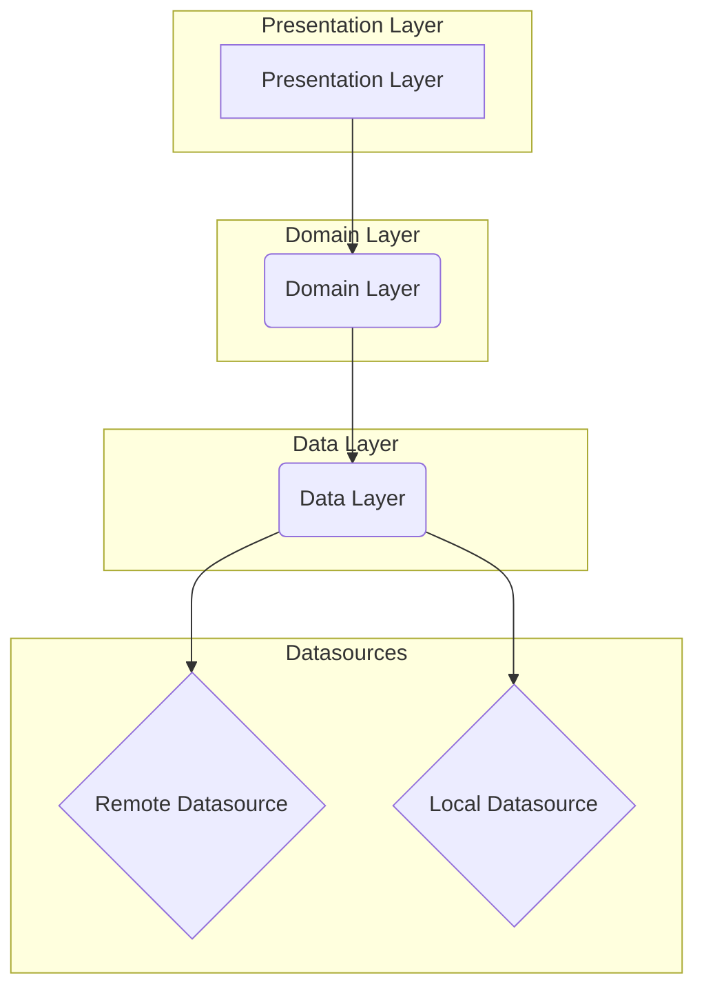
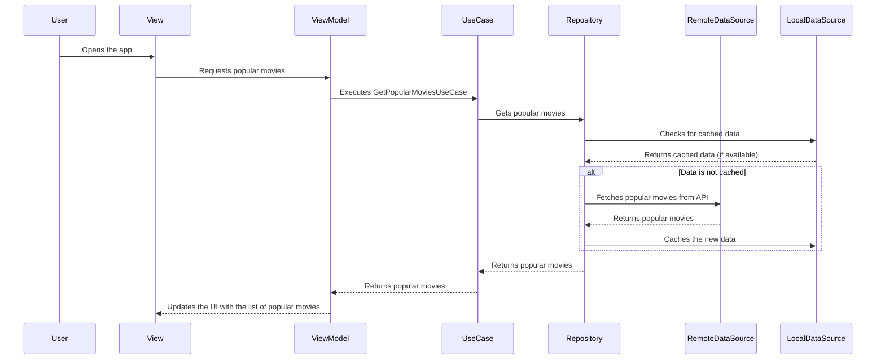

# Flixplorer
Flixploreris a cutting-edge, modern Android application built to demonstrate a robust and scalable architecture. It leverages the latest technologies and best practices in Android development to provide a seamless and feature-rich user experience for exploring movies and TV shows.

Powered by


## Features 🕹

- Follows [Guidlines on Recommended Architecture](https://developer.android.com/topic/architecture#recommended-app-arch)
- 100% Kotlin
- [Jetpack Compose](https://developer.android.com/jetpack/compose)
- [Coroutines](https://developer.android.com/kotlin/coroutines) - Coroutines provide us an easy way
  to do synchronous and asynchronous programming.
- [Flow](https://developer.android.com/kotlin/flow)
  & [StateFlow](https://developer.android.com/kotlin/flow/stateflow-and-sharedflow#stateflow) - Flow
  is a type of coroutine that emits multiple values sequentially.
- [Hilt](https://dagger.dev/hilt/) - Dependency Injection framework by Google 
- [Retrofit](https://github.com/square/retrofit) - Network client by Square
- [Material You](https://m3.material.io) and Dark theme Support - It has support for Material You & Light/Dark mode that can be toggled from preference screen
- [Paging 3](https://developer.android.com/topic/libraries/architecture/paging/v3-overview) - Pagination library for Jetpack compose 
- [DataStore](https://developer.android.com/topic/libraries/architecture/datastore) Preferences like API with coroutine & Flow support
- [Coil](https://coil-kt.github.io/coil/compose/) Image loading library for Compose
- [Detekt](https://github.com/detekt/detekt) Code smell analysis for Kotlin projects

## Work In Progress 🚧
- ~~Animations~~✅
- UI & Unit Tests

## Screenshots 📱


 

### How to build on your environment

Create an API key on [The Movie DB](https://www.themoviedb.org)'s and add in your
local `local.properties` file like this

```
TMDB_KEY=<REPLACE_WITH_YOUR_API_KEY>
```


# Architecture

The application follows the **MVVM (Model-View-ViewModel)** architectural pattern, which is highly recommended by Google for building robust and maintainable Android apps. The codebase is organized into three main layers: **Data**, **Domain**, and **Presentation**.

## High-Level Architecture Diagram



### Presentation Layer

The Presentation Layer is responsible for everything related to the user interface. It's built using **Jetpack Compose**, Google's modern toolkit for building native Android UI.

- **Views (Composable Functions):** The UI is composed of stateless composable functions that are lightweight and easy to test.
- **ViewModel:** Each screen has a corresponding ViewModel that holds the UI state and business logic. The ViewModels expose data to the UI using **Kotlin Flows** and are responsible for handling user interactions.
- **State Management:** The UI state is managed using `StateFlow` and `SharedFlow` to ensure a reactive and consistent user experience.
- **Navigation:** Navigation between screens is handled by **Jetpack Navigation Compose**, which provides a type-safe and declarative way to navigate between composables.

### Domain Layer

The Domain Layer contains the core business logic of the application. It's independent of any other layer and is responsible for defining the application's use cases.

- **Use Cases (Interactors):** Each use case represents a single business rule. For example, `GetPopularMoviesUseCase` would be responsible for fetching a list of popular movies.
- **Models:** The Domain Layer defines the core data models of the application. These models are independent of any specific data source.

### Data Layer

The Data Layer is responsible for providing data to the application. It's composed of **Repositories** and **Data Sources**.

- **Repositories:** The repositories are the single source of truth for the application's data. They are responsible for abstracting the data sources from the rest of the app.
- **Data Sources:** The application uses two types of data sources:
    - **Remote Data Source:** Fetches data from the **TMDb (The Movie Database) API** using **Retrofit** and **OkHttp**.
    - **Local Data Source:** Caches data locally using **Jetpack DataStore**.

### Dependency Injection

Dependency injection is implemented using **Hilt**, a dependency injection library for Android that simplifies the process of providing dependencies to different parts of the application.

### Asynchronous Programming

All asynchronous operations are handled using **Kotlin Coroutines**, which simplifies asynchronous programming and helps to avoid callback hell.

### Image Loading

Image loading is handled by **Coil**, a modern image loading library for Android that is fast, efficient, and easy to use.

### Sequence Diagram: Fetching Popular Movies

Here's a sequence diagram that illustrates how the different components of the application interact to fetch a list of popular movies:



This architecture ensures that the application is:

- **Scalable:** New features can be added easily without affecting the existing codebase.
- **Testable:** Each component can be tested independently.
- **Maintainable:** The code is easy to understand and modify.
- **Robust:** The application is resilient to errors and can handle network failures gracefully.
