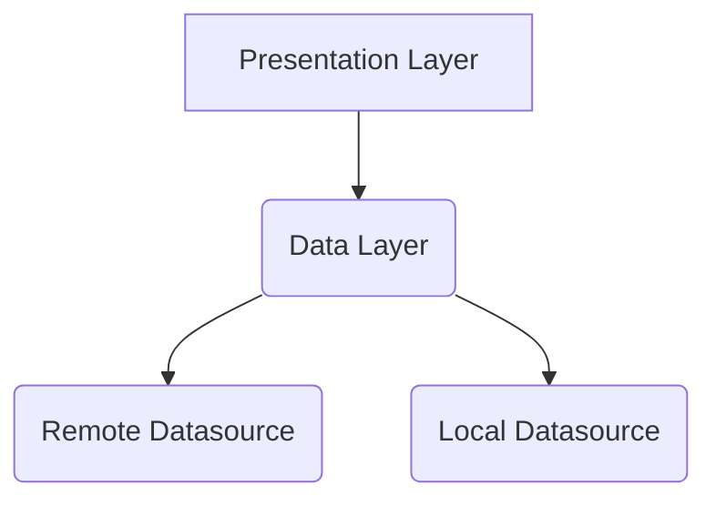
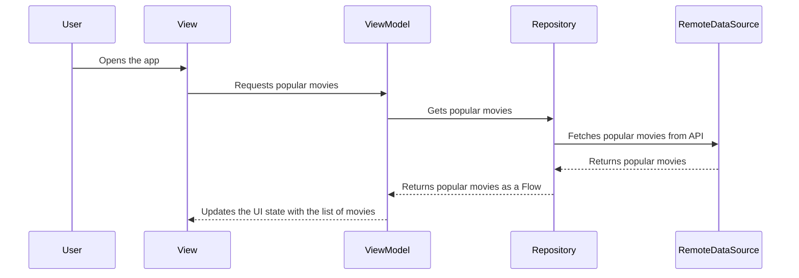
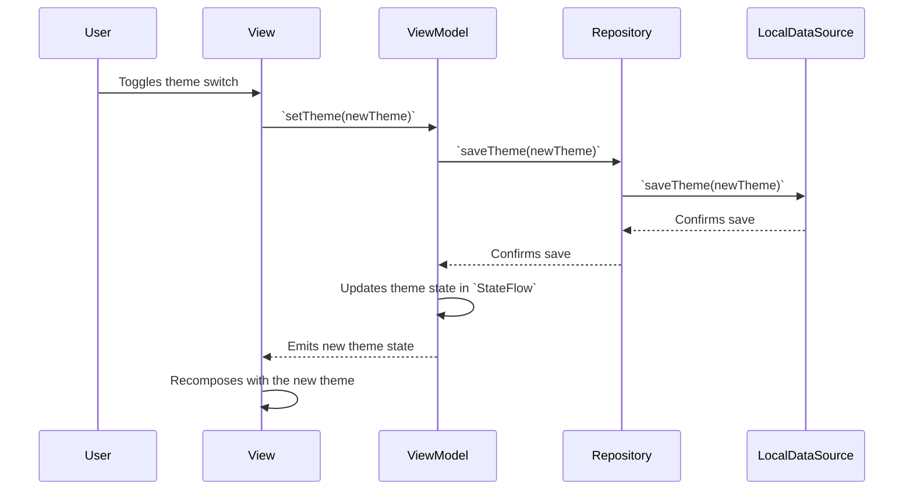

# Flixplorer
Flixploreris a cutting-edge, modern Android application built to demonstrate a robust and scalable architecture. It leverages the latest technologies and best practices in Android development to provide a seamless and feature-rich user experience for exploring movies and TV shows.

Powered by


## Architecture

Flixplorer is built upon a pragmatic and effective **MVVM (Model-View-ViewModel)** architecture. This design pattern creates a clear separation between the application's UI (View), its business logic and state (ViewModel), and its data-handling components (Model/Repository). This results in a codebase that is clean, easy to understand, and highly maintainable.

### High-Level Architecture

The application is primarily divided into two main layers:

- **Presentation Layer:** Handles everything related to the UI and user interaction.
- **Data Layer:** Manages all data operations, including network requests and local data persistence.



### Presentation Layer

This layer is responsible for what the user sees and interacts with. It is built using the latest Android technologies to provide a modern, reactive, and engaging user experience.

- **UI (Views):** The entire UI is built with **Jetpack Compose**, Google's modern, declarative UI toolkit. This allows for the creation of dynamic and beautiful user interfaces with significantly less code compared to the traditional XML-based approach.
- **ViewModel:** Each screen in the application has a corresponding `ViewModel`. The ViewModel acts as a bridge between the UI and the Data layer. Its primary responsibilities are:
    - To fetch data from the `Repository`.
    - To hold the UI state (e.g., the list of movies, loading status, errors) in an observable `StateFlow`.
    - To expose business logic and handle user events.
- **State Management:** The UI state is exposed from the ViewModel using **Kotlin's `StateFlow`**. The Composables in the View observe this flow and automatically re-render (recompose) when the state changes, ensuring the UI is always in sync with the underlying data.

### Data Layer

The Data Layer is the backbone of the application, responsible for all data-related operations. It abstracts the data sources from the rest of the app, providing a clean and consistent API for the ViewModels.

- **Repository:** The `Repository` is the single source of truth for all application data. It is responsible for:
    - Fetching data from the remote data source.
    - Managing user preferences stored in the local data source.
    - Exposing a simple API for the ViewModel to access data (e.g., `getPopularMovies()`, `getTheme()`).
    - Hiding the implementation details of the data sources.
- **Remote Data Source:** This component is responsible for fetching live data from the **TMDb (The Movie Database) API**. It is built using:
    - **Retrofit:** To define the API endpoints and handle the network requests.
    - **OkHttp:** As the underlying HTTP client for making the requests.
    - **kotlinx.serialization:** To seamlessly parse the JSON responses from the API into Kotlin data classes.
- **Local Data Source:** User-specific preferences, such as the selected theme (light/dark mode), are persisted locally using **Jetpack DataStore**. This provides a fast and efficient way to store simple key-value data and ensures that the user's choices are remembered across app launches.

### Core Technologies & Libraries

- **Dependency Injection (Hilt):** **Hilt** is used to manage dependencies throughout the application. It simplifies the process of providing instances of the `Repository`, `ViewModel`, and other classes where they are needed, which is crucial for building a scalable and testable application.
- **Asynchronous Programming (Kotlin Coroutines):** All asynchronous tasks, such as network requests and DataStore operations, are handled using **Kotlin Coroutines**. This allows for writing asynchronous code in a sequential manner, making it more readable and less error-prone.
- **Image Loading (Coil):** **Coil** is used for efficiently loading and displaying images from the network. It provides a simple and powerful API for handling image loading, caching, and transformations.

### Sequence Diagram: Fetching Popular Movies

This diagram illustrates the flow of data when the user opens the app to view popular movies. In this flow, the data is fetched directly from the remote source.



### Sequence Diagram: Updating User Theme Preference

This diagram shows how the application handles updating and persisting a user's theme preference.



This architecture ensures that Flixplorer is:

- **Robust:** With a clear separation of concerns and proper error handling.
- **Testable:** Each component can be tested independently.
- **Scalable:** New features can be added with minimal friction.
- **Maintainable:** The code is easy to read, understand, and modify.

## Uses 🕹

- [Guidlines on Recommended Architecture](https://developer.android.com/topic/architecture#recommended-app-arch)
- [Jetpack Compose](https://developer.android.com/jetpack/compose)
- [Coroutines](https://developer.android.com/kotlin/coroutines)
- [Hilt](https://dagger.dev/hilt/)
- [Retrofit](https://github.com/square/retrofit)
- [Material You](https://m3.material.io)
- [Paging 3](https://developer.android.com/topic/libraries/architecture/paging/v3-overview) 
- [DataStore](https://developer.android.com/topic/libraries/architecture/datastore)
- [Coil](https://coil-kt.github.io/coil/compose/)
- [Detekt](https://github.com/detekt/detekt)

## Screenshots 📱


 

### How to build on your environment

Create an API key on [The Movie DB](https://www.themoviedb.org)'s and add in your
local `local.properties` file like this

```
TMDB_KEY=<REPLACE_WITH_YOUR_API_KEY>
```
